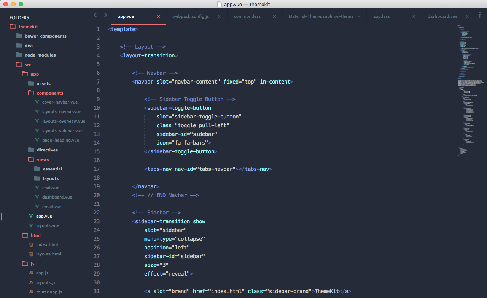

# (my) Sublime setup



### Install Package Control

[https://packagecontrol.io/installation](https://packagecontrol.io/installation)

### Install Packages

##### Instructions

1. Run "Package Control: Install Package"
2. Search for the following packages.

##### Packages

1. [Material Theme](https://github.com/equinusocio/material-theme) - General theme
2. [Colorsublime](https://github.com/Colorsublime/Colorsublime-Plugin) - Color schemes manager
3. [PackageResourceViewer](https://github.com/skuroda/PackageResourceViewer) - Edit files from Package Control packages
4. [AdvancedNewFile](https://github.com/skuroda/Sublime-AdvancedNewFile) - File management
5. [Emmet](https://github.com/sergeche/emmet-sublime) - ex-Zen Coding
6. [LESS](https://github.com/danro/Less-sublime) - Less Syntax highlighting
7. [FuzzyFilePath](https://github.com/sagold/FuzzyFilePath) - File paths autocompletion
8. [Vue Syntax Highlight](https://github.com/vuejs/vue-syntax-highlight) - Syntax highlighting for `.vue` files (single-file Vue.js components)

### Install Color Scheme

[Facebook](http://colorsublime.com/theme/Facebook)

1. Run "Colorsublime: Install Theme" command
2. Select "Facebook"

### Preferences.sublime-settings

##### Sublime Text -> Preferences -> Settings - User

```
{
	"always_show_minimap_viewport": false,
	"bold_folder_labels": true,
	"color_scheme": "Packages/Colorsublime - Themes/Facebook.tmTheme",
	"font_size": 14,
	"ignored_packages":
	[
		"Vintage"
	],
	"indent_guide_options":
	[
		"draw_normal",
		"draw_active"
	],
	"line_padding_bottom": 3,
	"line_padding_top": 3,
	"material_theme_accent_red": true,
	"material_theme_tabs_separator": true,
	"overlay_scroll_bars": "enabled",
	"theme": "Material-Theme.sublime-theme",
	"use_simple_full_screen": true
}
```

### Update Material Theme

##### Open theme file

1. Run "PackageResourceViewer: Open Resource"
2. Select "Material Theme"
3. Select "Material-Theme.sublime-theme"

##### Update colors

1. Select the default tint colors `[38, 50, 56]` (`cmd+ctrl+g` on Mac to select all occurrences)
3. Replace with `[37, 43, 57]` (Facebook)

### Default (OSX).sublime-keymap

##### Sublime Text -> Preferences -> Key Bindings - User

```
[
	{ "keys": ["n", "n", "n"], "command": "advanced_new_file_new"},
	{ "keys": ["n", "n", "r"], "command": "advanced_new_file_move"},
	{ "keys": ["n", "n", "d"], "command": "advanced_new_file_delete", "args": { "current": true }},
	{ "keys": ["super+."], "command": "insert_path", "args": { "type": "relative" }},
    { "keys": ["super+g"], "command": "find_all_under" }
]
```
	
### AdvancedNewFile.sublime-settings

##### Sublime Text -> Preferences -> Package Settings -> AdvancedNewFile -> Settings - User

```
{
	"default_initial": ":",
	"append_extension_on_move": true,
	"warn_overwrite_on_move": true,
	"rename_default": ":<filename>",
	"cursor_before_extension": true,
}
```

### FuzzyFilePath.sublime-settings

**Note**: This is only required to fix an open issue with file paths autocompletion from Less files. See [https://github.com/sagold/FuzzyFilePath/issues/24](https://github.com/sagold/FuzzyFilePath/issues/24)

##### Sublime Text -> Preferences -> Package Settings -> FuzzyFilePath - Settings - User

1. Paste all the default settings from Sublime Text -> Preferences -> Package Settings -> FuzzyFilePath - Settings - Default
2. To fix the issue above, comment out the following block:

```
{
    // (s)css: import
    "scope": "(css|sass)\\s",
	
    "auto": true,
    "prefix": ["import"],
    "relative": false,
    "extensions": ["css", "scss"],
    "replace_on_insert": [
        ["\\.(css|scss)$", ""],
        ["^\\/bower_components\\/", ""]
    ]
},
```